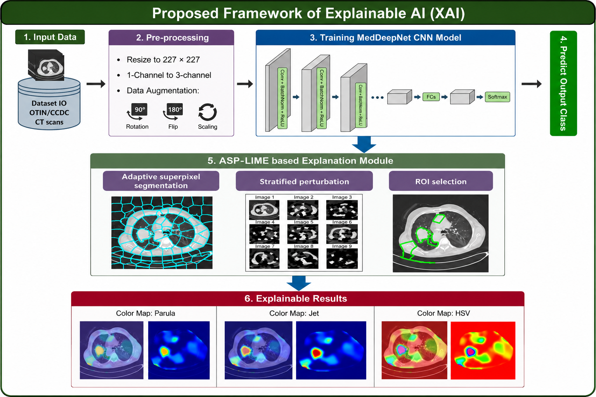
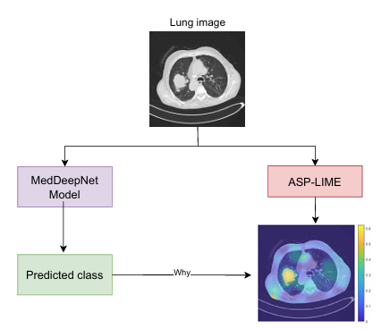

  

# ASP-LIME for Explainable Medical Imaging
Explainable AI Approach

## Overview

Deep learning models have demonstrated remarkable success in medical image analysis, achieving high diagnostic performance in various clinical applications. However, their complex architectures often operate as "black-box" systems, making it difficult for clinicians and researchers to understand the reasoning behind model predictions.

This repository presents **ASP-LIME (Adaptive Superpixel Perturbation-based LIME)**, an enhanced explainable artificial intelligence (XAI) framework designed to improve the interpretability, stability, and clinical relevance of explanations generated by deep learning models for medical image analysis.

ASP-LIME extends the traditional Local Interpretable Model-Agnostic Explanations (LIME) framework by introducing adaptive superpixel segmentation, anatomical region-aware perturbation, and improved sampling strategies to generate more meaningful local explanations.

The goal of ASP-LIME is to bridge the gap between high-performing deep learning models and trustworthy AI systems by providing transparent explanations that can support human decision-making in healthcare.

## Key Features

- Adaptive superpixel-based image segmentation
- Anatomical region-aware explanation generation
- Stratified perturbation strategy
- Model-agnostic explanation framework
- Compatible with deep learning models for medical image classification
- Visualization of important image regions contributing to model predictions

## Experimental Setup

The ASP-LIME framework was implemented using MATLAB R2024a and evaluated on medical images resized to 227 × 227 pixels according to the input requirements of the MedDeepNet architecture.

### ASP-LIME Configuration

The main parameters used for ASP-LIME are summarized below:

| Parameter | Setting |
|-----------|---------|
| Implementation platform | MATLAB R2024a |
| Image input size | 227 × 227 pixels |
| Superpixel generation | Adaptive superpixels |
| Superpixel range | 50 - 100 |
| Color space | LAB |
| Compactness value | 20 |
| Perturbation strategy | Stratified perturbation |
| Perturbation range | 0.1 - 0.9 |
| Number of perturbation samples | 1000 per image |
| Surrogate model | Ridge-regularized linear regression |
| Regularization parameter (λ) | 0.1 |
| Kernel function | Gaussian kernel |
| Kernel bandwidth | 0.25 × SD |

Adaptive superpixels were generated in LAB color space to preserve meaningful image structures. Stratified perturbations were applied to generate diverse local samples while maintaining image characteristics. A ridge-regularized linear regression model was used as the local surrogate model to approximate the behavior of the deep learning classifier.

Gaussian kernel weighting was applied to assign higher importance to samples closer to the original instance. The bandwidth was selected empirically to achieve a balance between locality and explanation stability.

The generated explanation maps were further refined using adaptive Gaussian filtering and lung-region masking based on thresholding and morphological operations to improve anatomical relevance.

### Hardware and Software Environment

All experiments were performed on a workstation with the following configuration:

- Operating System: Windows 11 Pro (64-bit, Version 23H2)
- Processor: Intel Core i7-10700 @ 2.90 GHz
- RAM: 32 GB
- GPU: NVIDIA GeForce RTX 3060 Ti (16 GB VRAM)

This configuration enabled efficient execution of computationally intensive tasks, including image segmentation, deep learning inference, and explainable AI analysis.

## Visualization Results

To demonstrate the effectiveness of ASP-LIME, visualization experiments were conducted by comparing the explanations generated by conventional LIME and the proposed ASP-LIME framework.

The visualization results highlight the ability of ASP-LIME to generate more focused, stable, and anatomically meaningful explanations for deep learning-based medical image classification.

  

